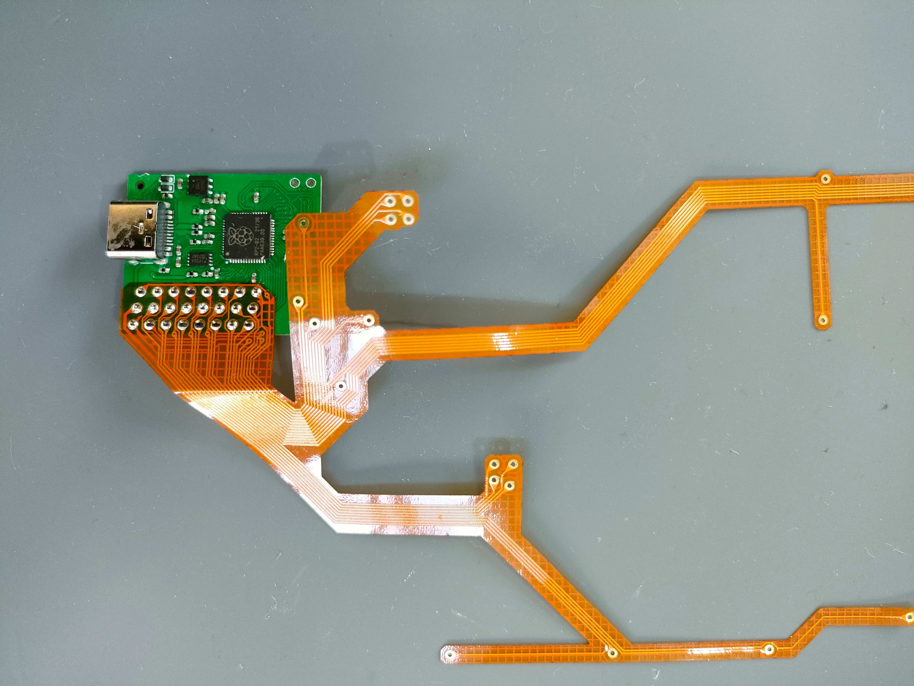
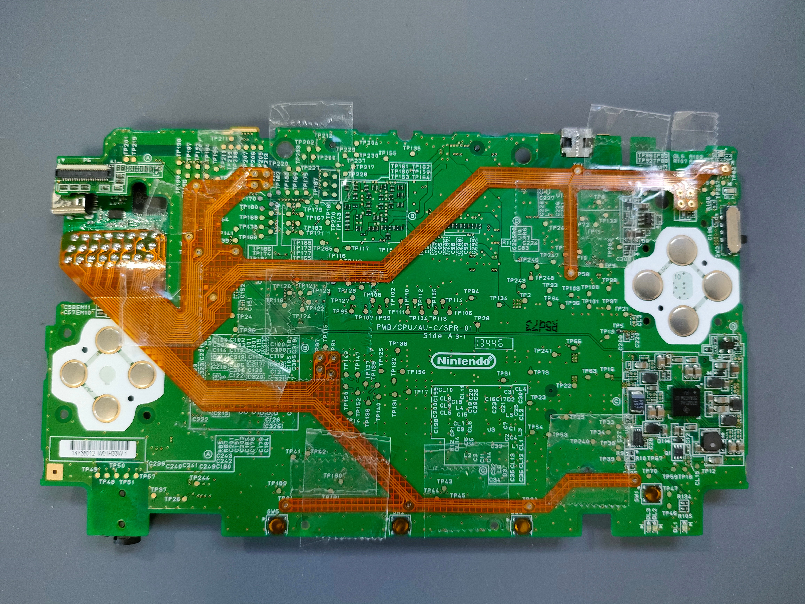
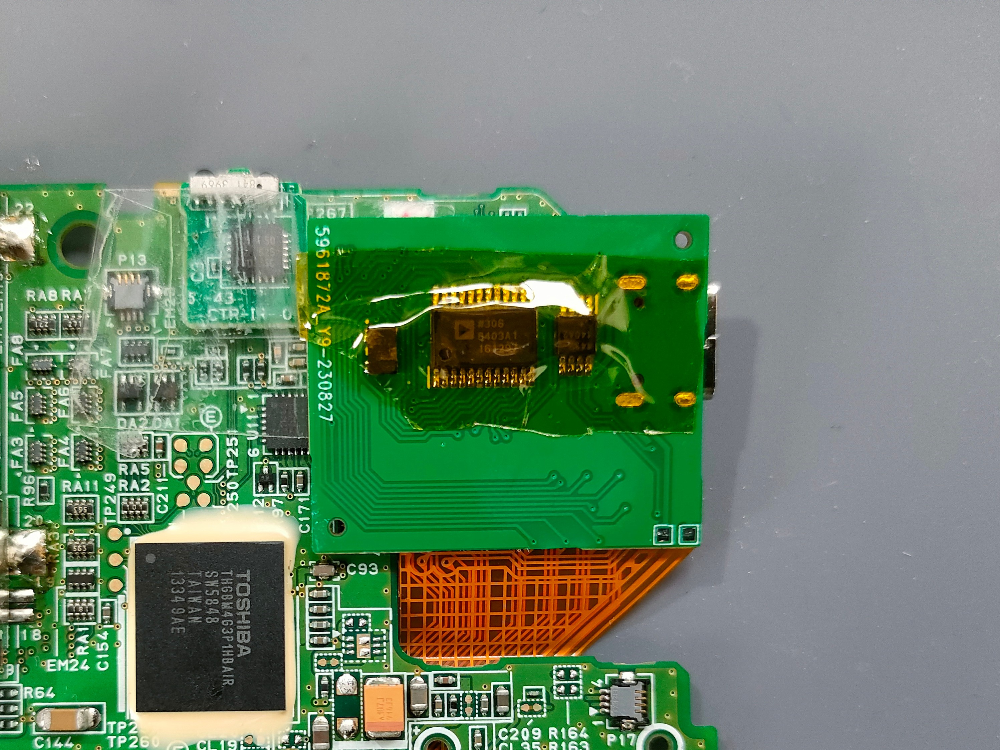

# 取り付けガイド

3DS LLのTPに対応するフレキシブル基板を用意しているので、はんだ付けして筐体を加工するだけで取り付けられます。

セロハンテープ等でしっかりと位置決めしてからはんだ付けしてください。はんだ付けが甘いと、一部の操作が効かない問題が発生します。

はんだ付け後は、以下の位置をカプトンテープ等で固定しておくことをおすすめします。折り返し部に近いTP32にかかる負荷を抑えています。

基板裏面は安全のためカプトンテープ等で絶縁してください。

