# firmware

## Basic idea

Note that this is not necessarily accurate as a diagram (for starters, there are no classes in the C language).

The figure means that the ncm core library is written in a way that is independent of the Arduino and the various ICs.

[View in Mermaid Live Editor](https://mermaid.live/edit#pako:eNqdVl1P2zAU_SuRn9jUVgUKhAhV6ujE-sCoFCSmqVLlxbeNtcSOHJtCgf8-Ox9q7Iaw4pe65x6f-2krLyjiBFCAogTn-ZTitcDpgjGcQp7hCDwWpd7Lgnl6FRTvZ5TeAAOBk7kSGc9hdjdjEsTKsCumWVdXtIbH4x2cg1wmfHP0xXvklNh4TJdby_DmOL5WQgCT08k1Z48gtPxBrin7e0S4-pOA94gTBXsxcCUieJfiRjOlayp1GbjUMVGewqHx6JQ3NAOx1GWkWoHVruv_boAZ32i25u1FHitJ-IZ1Vi-ch_fhhsooPiTKFm98tXIdOa6-KSk5a6p3js06o3xHjXlC9nwKSADn0JngDywdl1UcKmtDBV3Hss1gKtmGJ7CSTpil1ykVEJmGeaTefSb-MKEE5pg4SXRNvflPI5z894GYC7rlTDaPFJlUo_fU86rdc3cKXnsO91xFcRgJALf93delNZHuI22pvDPm-ebz2Vr9KkZ99zpOBFGUcfuFvJnP7uyLleWgCG_eqoyyZU63sJRma-G3-kE-su09T19NL9UGN0pSVuhBUNl-qPsVe9Dj2hWqRQ7nsw-4TnUw8UfDJ7s4k6nGftVYeabCBoOx8eFqrP3hsatx08BqjQIzGqb-tgjJR6PTE1tkGjaxUqTCjIipjC2SYsr2Gz0hONNT1tBxXXQxysw_ZtwLmiXQzTP57zOKljQD_drvVxVqov3-67jzjTYydrRGqERcSy3WeX13gnZy-7K2_QDxZkVKWYO4llqw5d0wMnYTjUyJuJZapuPxRT2UgtBzRPQHV9GiBZIxpLBAgd4SWGGVyAXSXdNUrCQPn1mEAikU9JDKCJZQfaKhYIWTXKMZZr85T23Sd0IlF00OCl7QEwqGPfSMgpPLs4F_ce6f-ReXl8cX56dvPbQtRI4Hw2r5I7P80x6CQuy2-kw0P2__AKHLP_M)

```mermaid
classDiagram
namespace ncm {
    class NcmGeneralPurposeIOInterface {
        <<interface>>
        set_low() void
        set_hi_z() void
    }
    class NcmCurrentDAConverterInterface {
        <<interface>>
        sink(double value) void
        source(double value) void
    }
    class NcmDigitalPotentiometerInterface {
        <<interface>>
        set_wiper_position(double position) void
        power_on() void
        shutdown() void
    }
    class NcmSPSTSwitchInterface {
        <<interface>>
        on() void
        off() void
    }

    class NcmButton {
        NcmGeneralPurposeIOInterface gpio
        hold() void
        release() void
    }
    class NcmHat {
        NcmButton up
        NcmButton right
        NcmButton down
        NcmButton left
        hold(NcmHatDirection direction) void
        release() void
    }
    class NcmSlidePad {
        NcmCurrentDAConverterInterface vertical
        NcmCurrentDAConverterInterface horizontal
        hold(double x, double y) void
        release() void 
    }
    class NcmTouchScreen {
        NcmDigitalPotentiometerInterface vertical
        NcmDigitalPotentiometerInterface horizontal
        NcmSPSTSwitchInterface sw
        hold(double x, double y) void
        release()void
    }
}

namespace Arduino {
    class GPIO {
        <<pseudo>>
        pin_size_t pin
        pinMode(pin_size_t pin, int mode) void
        digitalWrite(pin_size_t pin, int value) void
    }
    class Wire {
        <<pseudo>>
    }
    class SPI {
        <<pseudo>>
    }
}

namespace ad840x {
    class AD840X {
    }
}
AD840X ..> SPI

namespace adg801 {
    class ADG801 {
    }
}
ADG801 ..> GPIO

namespace ds4432 {
    class DS4432 {
    }
}
DS4432 ..> Wire

namespace main {
    class GPIOAdapter {
    }
    class DS4432Adapter {
    }
    class AD840XAdapter {
    }
    class AD840XTripleAdapter {
    }
    class ADG801Adapter {
    }
}

GPIOAdapter *-- GPIO
GPIOAdapter --|> NcmGeneralPurposeIOInterface

AD840XAdapter *-- AD840X
AD840XAdapter --|> NcmDigitalPotentiometerInterface

AD840XTripleAdapter *-- AD840X
AD840XTripleAdapter --|> NcmDigitalPotentiometerInterface

ADG801Adapter *-- ADG801
ADG801Adapter --|> NcmSPSTSwitchInterface

DS4432Adapter *-- DS4432
DS4432Adapter --|> NcmCurrentDAConverterInterface
```

