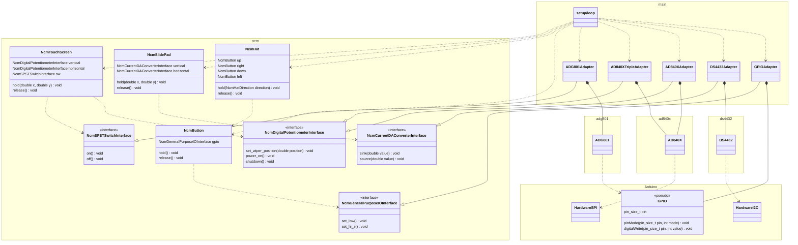

# firmware

## Basic idea

Note that this is not necessarily accurate as a diagram (for starters, there are no classes in the C language).

The figure means that the ncm core library is written in a way that is independent of the Arduino and the various ICs.

[View in Mermaid Live Editor](https://mermaid.live/edit#pako:eNqdVltv2jAU_iuRn7qJMkjZoKiqxMrU8tAVLZU2bZmQFx_AWmJHjl1auv73OTeIE5NewgPJ-b7jcz_JIwo4ATRGQYiTZErxSuDIZwxHkMQ4AIcFkfPoM0dfGcX5GkSXwEDgcK5EzBOY3cyYBLFM2QUzvc7OaCk-P9-LE5CLkG-O3jl3nBJTvqaLrQE81QxfKCGAyenkgrM7EPr4V5mm7O8R4epPCM4dDhU0fOBKBHCQUvdmSldU6jRwqX2iPILX-qND3tAYxEKnkeoTWGm6fK47GPONZmtew_O1koRvWGv2vLl3622oDNav8dJijS-XdUM1U5-VlJxVT29tm1VM-Z665iFp2BQQAk6gNcArLGsmCz9UbJMKulpLG5Bm0iYPYSlrbuZWp1RAkBbMIeXdW_z3QkpgjkktiLauT59pgMMXK6y5oFvOZFUli6RovfuOU9w9tIfg2GO45SpYe4EAqJe_fVysgbSr2EI50ObJ5u3RGvXKWn3fEd3ueWtnZ9y0LQtirpZJd8UuoJaiZfxqYguV1vQcUrKkJ41pv_EngijKuLn1L-ezG3NZxAkowqubIqZskdAtLGR6a8iv9UvmyMQ7jl43TqSBeuZJHtZ3QaVdqX0zX2FBNljAzL2wib35rCjjPmRMRoPevRnxZKplPyzU1ajXr1MvtaxBJclgcOKa1KmXyhrUCFPWTPiE4FiXqKlvAXJ3DwK3gsYhWOHUdwtwrV36xpWkDH75SL-rVPwh5Dz20e_C_YqLzvvj48xlU3p8_O-5-fBZHlLWnkbpjFAzA2XyTKQ00jpA6S_PhGEoawYjdZmhsvYmUhp6ZuwsCbccauIvPDpVTsuVxZCn26hfYSfvRhMpLRwY_0q1d4fvmqIO1pqwDtda0Q7XGrJJMtqySagsUwukV65VXi5dK1hZlqiDIhB6Kon-NM7m0kdyDRH4aKxvCSyxCqWP9CRoKlaSew8sQOMlDhPoIBUTLKH4mt5JY8x-cq6fpVA70hdCJRdVDho_ons07nXQAxq77ml3eDL6OBz2R6ej_qk7fOqgbXZKv9vLL9d1R_1PJ8NBB0F22nXxSZ_-Pf0HS2njBA)

